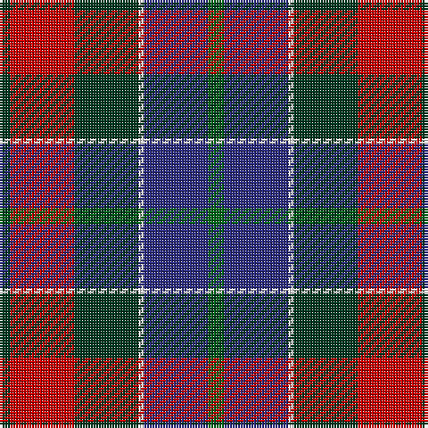

The parent of this is [Patterson, John (Personal)](/tartans/dg/4/r24/dg24/w2/db24/g/6/)

This was sourced from tartans-authority.  It is a [6 stripes tartan](/stripes/stripes6/).

Original link http://www.tartansauthority.com/tartan-ferret/display/2191/

## Thread count
DG/4 R24 DG24 W2 DB24 G/6

## Palette
Each colour and its ΔE from the base-6 reference it is a variant of.

| Colour | Shade | Base | ΔE (OKLab) |
|---|---|---|---|
| DB |  `#2C2C80` | B  | 0.05 |
| DG |  `#003820` | G  | 0.16 |
| G |  `#006818` | G  | 0.02 |
| R |  `#C80000` | R  | 0.00 |
| W |  `#FCFCFC` | W  | 0.03 |

# Sample pattern

ID: /variants/dg/4/r24/dg24/w2/db24/g/6-db2c2c80-dg003820-g006818-rc80000-wfcfcfc/
