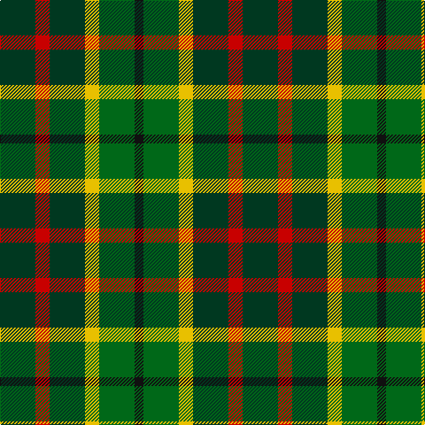

The parent of this is [Cates Armigers (Personal)](/tartans/dg/40/r16/dg40/y16/g40/k/10/)

This was sourced from tartans-authority.  It is a [6 stripes tartan](/stripes/stripes6/).

Original link http://www.tartansauthority.com/tartan-ferret/display/6929/

## Thread count
DG/40 R16 DG40 Y16 G40 K/10

## Palette
Each colour and its ΔE from the base-6 reference it is a variant of.

| Colour | Shade | Base | ΔE (OKLab) |
|---|---|---|---|
| DG |  `#003820` | G  | 0.16 |
| G |  `#006818` | G  | 0.02 |
| K |  `#101010` | K  | 0.17 |
| R |  `#C80000` | R  | 0.00 |
| Y |  `#E8C000` | Y  | 0.00 |

# Sample pattern

ID: /variants/dg/40/r16/dg40/y16/g40/k/10-dg003820-g006818-k101010-rc80000-ye8c000/
