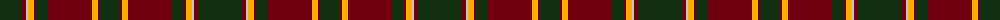

The parent of this is [Glendronach Distillery (Corporate)](/tartans/dg/44/dr4/n2/y6/dr2/dg12/dr44/y6/dr2/dg/20/)

This was sourced from tartans-authority.  It is a [10 stripes tartan](/stripes/stripes10/).

Original link http://www.tartansauthority.com/tartan-ferret/display/2293/

## Thread count
DG/44 DR4 N2 Y6 DR2 DG12 DR44 Y6 DR2 DG/20

## Palette
Each colour and its ΔE from the base-6 reference it is a variant of.

| Colour | Shade | Base | ΔE (OKLab) |
|---|---|---|---|
| DG |  `#103010` | G  | 0.18 |
| DR |  `#70000C` | R  | 0.20 |
| N |  `#C4C4C4` | W  | 0.15 |
| Y |  `#FCAC00` | Y  | 0.06 |

ID: /variants/dg/44/dr4/n2/y6/dr2/dg12/dr44/y6/dr2/dg/20-dg103010-dr70000c-nc4c4c4-yfcac00/
