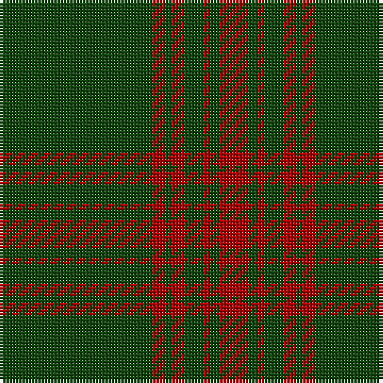

The parent of this is [Menzies Hunting](/tartans/dg/48/dr4/dg2/dr4/dg6/dr2/dg3/dr/9/)

This was sourced from weddslist.  It is a [8 stripes tartan](/stripes/stripes8/).

Original link http://www.weddslist.com/cgi-bin/tartans/pg.pl?source=x

## Thread count
DG/48 DR4 DG2 DR4 DG6 DR2 DG3 DR/9

## Palette
Each colour and its ΔE from the base-6 reference it is a variant of.

| Colour | Shade | Base | ΔE (OKLab) |
|---|---|---|---|
| DG |  `#11450D` | G  | 0.10 |
| DR |  `#AA0000` | R  | 0.06 |

# Sample pattern

ID: /variants/dg/48/dr4/dg2/dr4/dg6/dr2/dg3/dr/9-dg11450d-draa0000/
