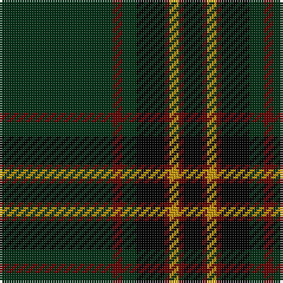

The parent of this is [Green Ridge](/tartans/dg/48/dr4/dg6/k12/dr2/dy4/dr2/k/8/)

This was sourced from register-of-tartans.  It is a [8 stripes tartan](/stripes/stripes8/).

Original link https://www.tartanregister.gov.uk/tartanDetails.aspx?ref=1525

## Thread count
DG/48 DR4 DG6 K12 DR2 DY4 DR2 K/8

## Palette
Each colour and its ΔE from the base-6 reference it is a variant of.

| Colour | Shade | Base | ΔE (OKLab) |
|---|---|---|---|
| DG |  `#003014` | G  | 0.18 |
| DR |  `#640000` | R  | 0.22 |
| DY |  `#C89800` | Y  | 0.12 |
| K |  `#000000` | K  | 0.00 |

# Sample pattern

ID: /variants/dg/48/dr4/dg6/k12/dr2/dy4/dr2/k/8-dg003014-dr640000-dyc89800-k000000/
