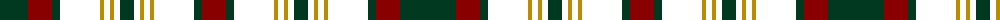

The parent of this is [Cork, County](/tartans/dg/56/dr24/dg8/com40/dy4/com6/dy4/com6/dg14/com6/dy4/com6/dy4/com40/dg8/dr/24/)

This was sourced from register-of-tartans.  It is a [16 stripes tartan](/stripes/stripes16/).

Original link https://www.tartanregister.gov.uk/tartanDetails.aspx?ref=760

## Thread count
DG/56 DR24 DG8 COM40 DY4 COM6 DY4 COM6 DG14 COM6 DY4 COM6 DY4 COM40 DG8 DR/24

## Palette
Each colour and its ΔE from the base-6 reference it is a variant of.

| Colour | Shade | Base | ΔE (OKLab) |
|---|---|---|---|
| DB |  `#1C0070` | B  | 0.14 |
| DBa |  `#202060` | B  | 0.11 |
| DBb |  `#1C0044` | B  | 0.20 |
| DG |  `#003820` | G  | 0.16 |
| DR |  `#880000` | R  | 0.14 |
| DRa |  `#A00000` | R  | 0.09 |
| DY |  `#BC8C00` | Y  | 0.16 |
| G |  `#005448` | G  | 0.11 |
| Ga |  `#006818` | G  | 0.02 |
| Y |  `#D8B000` | Y  | 0.05 |

ID: /variants/dg/56/dr24/dg8/com40/dy4/com6/dy4/com6/dg14/com6/dy4/com6/dy4/com40/dg8/dr/24-db1c0070-dba202060-dbb1c0044-dg003820-dr880000-draa00000-dybc8c00-g005448-ga006818-yd8b000/
