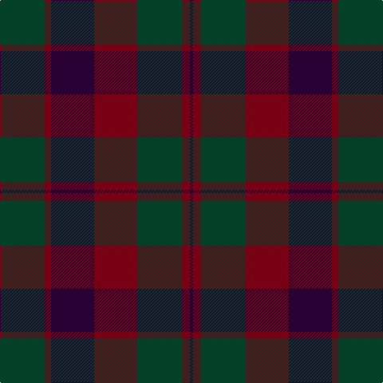

The parent of this is [Madder](/tartans/dg/56/dr8/dp54/dr54/dg56/dr10/dp/4/)

This was sourced from register-of-tartans.  It is a [7 stripes tartan](/stripes/stripes7/).

Original link https://www.tartanregister.gov.uk/tartanDetails.aspx?ref=2778

## Thread count
DG/56 DR8 DP54 DR54 DG56 DR10 DP/4

## Palette
Each colour and its ΔE from the base-6 reference it is a variant of.

| Colour | Shade | Base | ΔE (OKLab) |
|---|---|---|---|
| DG |  `#044028` | G  | 0.14 |
| DP |  `#280034` | B  | 0.21 |
| DR |  `#780014` | R  | 0.18 |

# Sample pattern

ID: /variants/dg/56/dr8/dp54/dr54/dg56/dr10/dp/4-dg044028-dp280034-dr780014/
