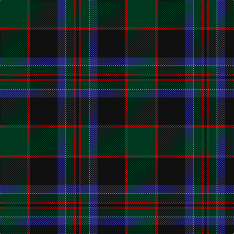

The parent of this is [Stansbury](/tartans/dg/56/r6/k56/db16/b2/dg16/r4/k/6/)

This was sourced from tartans-authority.  It is a [8 stripes tartan](/stripes/stripes8/).

Original link http://www.tartansauthority.com/tartan-ferret/display/11120/

## Thread count
DG/56 R6 K56 DB16 B2 DG16 R4 K/6

## Palette
Each colour and its ΔE from the base-6 reference it is a variant of.

| Colour | Shade | Base | ΔE (OKLab) |
|---|---|---|---|
| B |  `#5C8CA8` | B  | 0.23 |
| DB |  `#2C2C80` | B  | 0.05 |
| DG |  `#003820` | G  | 0.16 |
| K |  `#101010` | K  | 0.17 |
| R |  `#C80000` | R  | 0.00 |

# Sample pattern

ID: /variants/dg/56/r6/k56/db16/b2/dg16/r4/k/6-b5c8ca8-db2c2c80-dg003820-k101010-rc80000/
