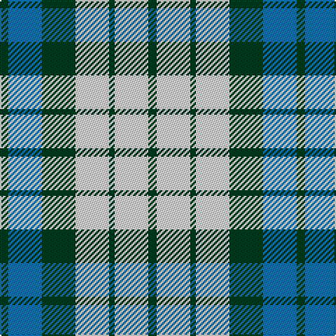

The parent of this is [Game Fair (Corporate)](/tartans/dg/6/b24/dgc24/ln24/dga4/ln24/dgb/6/)

This was sourced from tartans-authority.  It is a [7 stripes tartan](/stripes/stripes7/).

Original link http://www.tartansauthority.com/tartan-ferret/display/4081/

## Thread count
DG/6 B24 DGc24 LN24 DGa4 LN24 DGb/6

## Palette
Each colour and its ΔE from the base-6 reference it is a variant of.

| Colour | Shade | Base | ΔE (OKLab) |
|---|---|---|---|
| B |  `#1870A4` | B  | 0.14 |
| DG |  `#003820` | G  | 0.16 |
| DGa |  `#003820` | G  | 0.16 |
| DGb |  `#003820` | G  | 0.16 |
| DGc |  `#003820` | G  | 0.16 |
| LN |  `#E0E0E0` | W  | 0.06 |

# Sample pattern

ID: /variants/dg/6/b24/dgc24/ln24/dga4/ln24/dgb/6-b1870a4-dg003820-dga003820-dgb003820-dgc003820-lne0e0e0/
