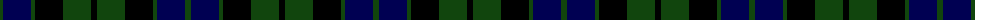

The parent of this is [MacKay](/tartans/dg/6/db28/dg4/k28/dg28/k/6/)

This was sourced from weddslist.  It is a [6 stripes tartan](/stripes/stripes6/).

Original link http://www.weddslist.com/cgi-bin/tartans/pg.pl?source=tinsel

## Thread count
DG/6 DB28 DG4 K28 DG28 K/6

## Palette
Each colour and its ΔE from the base-6 reference it is a variant of.

| Colour | Shade | Base | ΔE (OKLab) |
|---|---|---|---|
| DB |  `#000052` | B  | 0.20 |
| DG |  `#11450D` | G  | 0.10 |
| K |  `#000000` | K  | 0.00 |

# Sample pattern

ID: /variants/dg/6/db28/dg4/k28/dg28/k/6-db000052-dg11450d-k000000/
