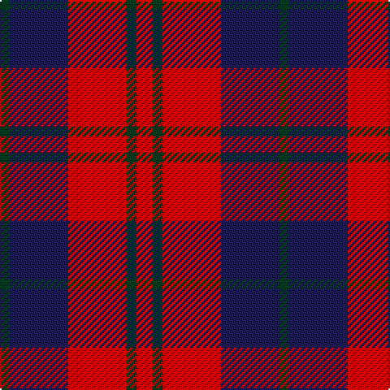

The parent of this is [Wotherspoon (Clan)](/tartans/dg/6/db36/r36/dg6/r/10/)

This was sourced from tartans-authority.  It is a [5 stripes tartan](/stripes/stripes5/).

Original link http://www.tartansauthority.com/tartan-ferret/display/741/

## Thread count
DG/6 DB36 R36 DG6 R/10

## Palette
Each colour and its ΔE from the base-6 reference it is a variant of.

| Colour | Shade | Base | ΔE (OKLab) |
|---|---|---|---|
| DB |  `#1C1C50` | B  | 0.14 |
| DG |  `#003820` | G  | 0.16 |
| R |  `#C80000` | R  | 0.00 |

# Sample pattern

ID: /variants/dg/6/db36/r36/dg6/r/10-db1c1c50-dg003820-rc80000/
