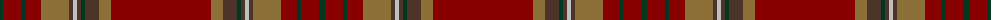

The parent of this is [Tyrone, County (District)](/tartans/dg/6/dr18/dg4/dr16/lt28/t4/n4/t4/dg4/t14/lt12/dr/100/)

This was sourced from tartans-authority.  It is a [12 stripes tartan](/stripes/stripes12/).

Original link http://www.tartansauthority.com/tartan-ferret/display/2264/

## Thread count
DG/6 DR18 DG4 DR16 LT28 T4 N4 T4 DG4 T14 LT12 DR/100

## Palette
Each colour and its ΔE from the base-6 reference it is a variant of.

| Colour | Shade | Base | ΔE (OKLab) |
|---|---|---|---|
| DG |  `#003820` | G  | 0.16 |
| DR |  `#880000` | R  | 0.14 |
| LT |  `#8C7038` | G  | 0.18 |
| N |  `#C0C0C0` | W  | 0.16 |
| T |  `#4C3428` | B  | 0.16 |

ID: /variants/dg/6/dr18/dg4/dr16/lt28/t4/n4/t4/dg4/t14/lt12/dr/100-dg003820-dr880000-lt8c7038-nc0c0c0-t4c3428/
