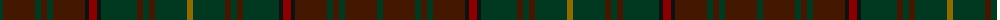

The parent of this is [Ontario, Ensign of (District)](/tartans/dg/6/dr32/dg6/dr6/dg6/dr32/k4/dra8/k4/dg36/dr6/dg6/dr6/dg32/t/6/)

This was sourced from tartans-authority.  It is a [15 stripes tartan](/stripes/stripes15/).

Original link http://www.tartansauthority.com/tartan-ferret/display/3140/

## Thread count
DG/6 DR32 DG6 DR6 DG6 DR32 K4 DRa8 K4 DG36 DR6 DG6 DR6 DG32 T/6

## Palette
Each colour and its ΔE from the base-6 reference it is a variant of.

| Colour | Shade | Base | ΔE (OKLab) |
|---|---|---|---|
| DG |  `#003820` | G  | 0.16 |
| DR |  `#441800` | B  | 0.22 |
| DRa |  `#880000` | R  | 0.14 |
| K |  `#101010` | K  | 0.17 |
| T |  `#906C00` | G  | 0.17 |

ID: /variants/dg/6/dr32/dg6/dr6/dg6/dr32/k4/dra8/k4/dg36/dr6/dg6/dr6/dg32/t/6-dg003820-dr441800-dra880000-k101010-t906c00/
