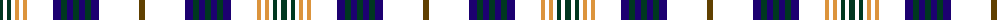

The parent of this is [Fermanagh, County](/tartans/dg/6/fzp4/dg4/fzp4/o4/fzp4/o4/fzp26/db8/dg6/db6/dg6/db6/dg6/db8/fzp40/t/6/)

This was sourced from register-of-tartans.  It is a [17 stripes tartan](/stripes/stripes17/).

Original link https://www.tartanregister.gov.uk/tartanDetails.aspx?ref=1171

## Thread count
DG/6 FZP4 DG4 FZP4 O4 FZP4 O4 FZP26 DB8 DG6 DB6 DG6 DB6 DG6 DB8 FZP40 T/6

## Palette
Each colour and its ΔE from the base-6 reference it is a variant of.

| Colour | Shade | Base | ΔE (OKLab) |
|---|---|---|---|
| DB |  `#1C0070` | B  | 0.14 |
| DG |  `#003820` | G  | 0.16 |
| O |  `#DC943C` | Y  | 0.12 |
| T |  `#604000` | G  | 0.14 |

ID: /variants/dg/6/fzp4/dg4/fzp4/o4/fzp4/o4/fzp26/db8/dg6/db6/dg6/db6/dg6/db8/fzp40/t/6-db1c0070-dg003820-odc943c-t604000/
