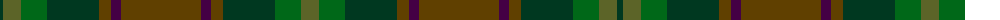

The parent of this is [de Meuron (Family)](/tartans/dg/6/g18/ga26/dg52/t12/dp10/t80/dp10/t12/dg52/ga26/g/18/)

This was sourced from tartans-authority.  It is a [12 stripes tartan](/stripes/stripes12/).

Original link http://www.tartansauthority.com/tartan-ferret/display/10576/

## Thread count
DG/6 G18 Ga26 DG52 T12 DP10 T80 DP10 T12 DG52 Ga26 G/18

## Palette
Each colour and its ΔE from the base-6 reference it is a variant of.

| Colour | Shade | Base | ΔE (OKLab) |
|---|---|---|---|
| DG |  `#003820` | G  | 0.16 |
| DP |  `#440044` | B  | 0.17 |
| G |  `#5C6428` | G  | 0.09 |
| Ga |  `#006818` | G  | 0.02 |
| T |  `#604000` | G  | 0.14 |

ID: /variants/dg/6/g18/ga26/dg52/t12/dp10/t80/dp10/t12/dg52/ga26/g/18-dg003820-dp440044-g5c6428-ga006818-t604000/
