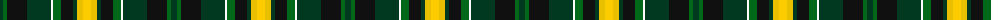

The parent of this is [Noble (South Africa) (Personal)](/tartans/dg/6/g4/k20/dg24/w2/g8/k12/dg4/ya6/y/8/)

This was sourced from tartans-authority.  It is a [10 stripes tartan](/stripes/stripes10/).

Original link http://www.tartansauthority.com/tartan-ferret/display/10903/

## Thread count
DG/6 G4 K20 DG24 W2 G8 K12 DG4 Ya6 Y/8

## Palette
Each colour and its ΔE from the base-6 reference it is a variant of.

| Colour | Shade | Base | ΔE (OKLab) |
|---|---|---|---|
| DG |  `#003820` | G  | 0.16 |
| G |  `#006818` | G  | 0.02 |
| K |  `#101010` | K  | 0.17 |
| W |  `#FCFCFC` | W  | 0.03 |
| Y |  `#FCCC00` | Y  | 0.04 |
| Ya |  `#E8C000` | Y  | 0.00 |

ID: /variants/dg/6/g4/k20/dg24/w2/g8/k12/dg4/ya6/y/8-dg003820-g006818-k101010-wfcfcfc-yfccc00-yae8c000/
