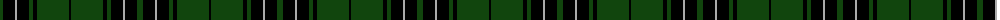

The parent of this is [MacLean VS](/tartans/dg/6/k12/n2/k12/dg4/k4/dg32/k/2/)

This was sourced from weddslist.  It is a [8 stripes tartan](/stripes/stripes8/).

Original link http://www.weddslist.com/cgi-bin/tartans/pg.pl?source=x

## Thread count
DG/6 K12 N2 K12 DG4 K4 DG32 K/2

## Palette
Each colour and its ΔE from the base-6 reference it is a variant of.

| Colour | Shade | Base | ΔE (OKLab) |
|---|---|---|---|
| DG |  `#11450D` | G  | 0.10 |
| K |  `#000000` | K  | 0.00 |
| N |  `#AAAAAA` | Y  | 0.19 |

# Sample pattern

ID: /variants/dg/6/k12/n2/k12/dg4/k4/dg32/k/2-dg11450d-k000000-naaaaaa/
