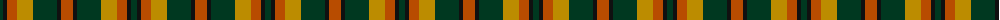
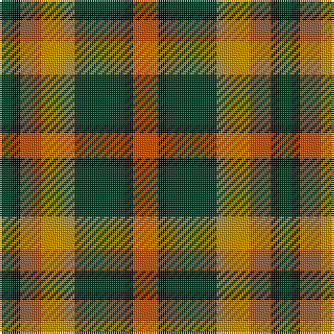

The parent of this is [Londonderry, County](/tartans/dg/6/k4/do10/dy16/dg24/k4/do/12/)

This was sourced from register-of-tartans.  It is a [7 stripes tartan](/stripes/stripes7/).

Original link https://www.tartanregister.gov.uk/tartanDetails.aspx?ref=2200

## Thread count
DG/6 K4 DO10 DY16 DG24 K4 DO/12

## Palette
Each colour and its ΔE from the base-6 reference it is a variant of.

| Colour | Shade | Base | ΔE (OKLab) |
|---|---|---|---|
| DG |  `#003820` | G  | 0.16 |
| DO |  `#B84C00` | R  | 0.08 |
| DY |  `#BC8C00` | Y  | 0.16 |
| K |  `#101010` | K  | 0.17 |

# Sample pattern

ID: /variants/dg/6/k4/do10/dy16/dg24/k4/do/12-dg003820-dob84c00-dybc8c00-k101010/
