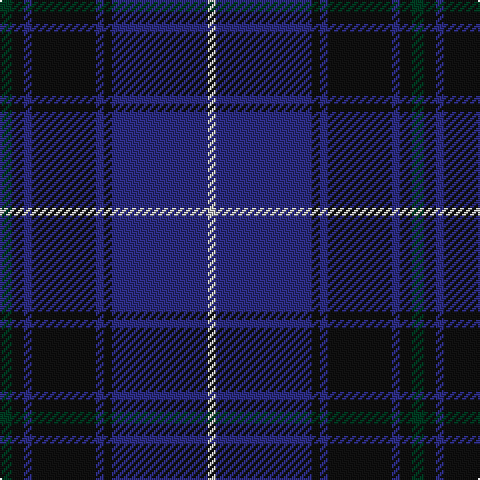

The parent of this is [Auckland New Zealand District Tartan Tartan Number: 3043. Earliest known date: 1999 Designed by the House of Tartan for Timely Marketing & Promotions Ltd, PO Box 28168, Christchurch, NZ. This company appears to have gone out of business without ever promoting the tartan. Copyright remains with the designers. See products available Copyright © Blair Urquhart, Comrie, 2015](/tartans/dg/6/k6/db4/k32/db4/k4/db48/n/4/)

This was sourced from house-of-tartan.  It is a [8 stripes tartan](/stripes/stripes8/).

Original link http://www.house-of-tartan.scotland.net/house/TartanViewjs.asp?colr=Def&tnam=3043

## Thread count
DG/6 K6 DB4 K32 DB4 K4 DB48 N/4

## Palette
Each colour and its ΔE from the base-6 reference it is a variant of.

| Colour | Shade | Base | ΔE (OKLab) |
|---|---|---|---|
| DB |  `#2C2C80` | B  | 0.05 |
| DG |  `#003820` | G  | 0.16 |
| K |  `#101010` | K  | 0.17 |
| N |  `#C0C0C0` | W  | 0.16 |

# Sample pattern

ID: /variants/dg/6/k6/db4/k32/db4/k4/db48/n/4-db2c2c80-dg003820-k101010-nc0c0c0/
