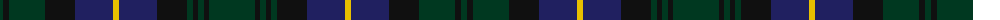

The parent of this is [Dewar Highlander Corporate Tartan Tartan Number: 694. Earliest known date: 1987. Based on MacNab. See products available Copyright © Blair Urquhart, Comrie, 2015](/tartans/dg/6/k6/dg36/k30/db38/y6/db38/k30/dg6/k5/dg6/k5/dg/46/)

This was sourced from house-of-tartan.  It is a [13 stripes tartan](/stripes/stripes13/).

Original link http://www.house-of-tartan.scotland.net/house/TartanViewjs.asp?colr=Def&tnam=694

## Thread count
DG/6 K6 DG36 K30 DB38 Y6 DB38 K30 DG6 K5 DG6 K5 DG/46

## Palette
Each colour and its ΔE from the base-6 reference it is a variant of.

| Colour | Shade | Base | ΔE (OKLab) |
|---|---|---|---|
| DB |  `#202060` | B  | 0.11 |
| DG |  `#003820` | G  | 0.16 |
| DR |  `#680028` | B  | 0.20 |
| K |  `#101010` | K  | 0.17 |
| Y |  `#E8C000` | Y  | 0.00 |

ID: /variants/dg/6/k6/dg36/k30/db38/y6/db38/k30/dg6/k5/dg6/k5/dg/46-db202060-dg003820-dr680028-k101010-ye8c000/
