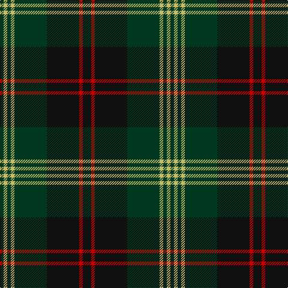

The parent of this is [Brunton (Personal)](/tartans/dg/6/lg6/dg6/lg6/dg54/k54/r6/k/14/)

This was sourced from register-of-tartans.  It is a [8 stripes tartan](/stripes/stripes8/).

Original link https://www.tartanregister.gov.uk/tartanDetails.aspx?ref=406

## Thread count
DG/6 LG6 DG6 LG6 DG54 K54 R6 K/14

## Palette
Each colour and its ΔE from the base-6 reference it is a variant of.

| Colour | Shade | Base | ΔE (OKLab) |
|---|---|---|---|
| DG |  `#003820` | G  | 0.16 |
| K |  `#101010` | K  | 0.17 |
| LG |  `#C4BC68` | Y  | 0.07 |
| R |  `#C80000` | R  | 0.00 |

# Sample pattern

ID: /variants/dg/6/lg6/dg6/lg6/dg54/k54/r6/k/14-dg003820-k101010-lgc4bc68-rc80000/
