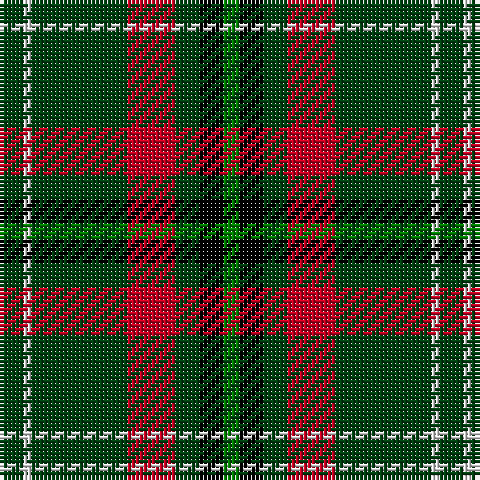

The parent of this is [Arkansas](/tartans/dg/6/ln2/dg24/r12/dg6/k6/g/4/)

This was sourced from weddslist.  It is a [7 stripes tartan](/stripes/stripes7/).

Original link http://www.weddslist.com/cgi-bin/tartans/pg.pl?source=sts

## Thread count
DG/6 LN2 DG24 R12 DG6 K6 G/4

## Palette
Each colour and its ΔE from the base-6 reference it is a variant of.

| Colour | Shade | Base | ΔE (OKLab) |
|---|---|---|---|
| DG |  `#004010` | G  | 0.12 |
| G |  `#008000` | G  | 0.09 |
| K |  `#000000` | K  | 0.00 |
| LN |  `#E0E0E0` | W  | 0.06 |
| R |  `#C00020` | R  | 0.02 |

# Sample pattern

ID: /variants/dg/6/ln2/dg24/r12/dg6/k6/g/4-dg004010-g008000-k000000-lne0e0e0-rc00020/
