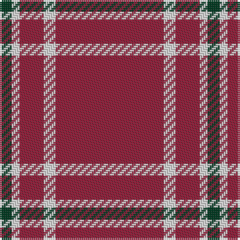

The parent of this is [Martin, Robert N (Personal)](/tartans/dg/6/ln4/dr12/ln6/dr/54/)

This was sourced from tartans-authority.  It is a [5 stripes tartan](/stripes/stripes5/).

Original link http://www.tartansauthority.com/tartan-ferret/display/10481/

## Thread count
DG/6 LN4 DR12 LN6 DR/54

## Palette
Each colour and its ΔE from the base-6 reference it is a variant of.

| Colour | Shade | Base | ΔE (OKLab) |
|---|---|---|---|
| DG |  `#003820` | G  | 0.16 |
| DR |  `#901C38` | R  | 0.12 |
| LN |  `#E0E0E0` | W  | 0.06 |

# Sample pattern

ID: /variants/dg/6/ln4/dr12/ln6/dr/54-dg003820-dr901c38-lne0e0e0/
