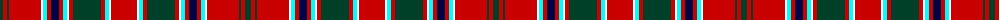

The parent of this is [MacDonald of Lochmaddy (Clan?)](/tartans/dg/6/r4/dg2/r32/w2/lb4/r4/db8/r4/lb4/w2/r4/dg28/r4/lb4/w2/r/26/)

This was sourced from tartans-authority.  It is a [17 stripes tartan](/stripes/stripes17/).

Original link http://www.tartansauthority.com/tartan-ferret/display/971/

## Thread count
DG/6 R4 DG2 R32 W2 LB4 R4 DB8 R4 LB4 W2 R4 DG28 R4 LB4 W2 R/26

## Palette
Each colour and its ΔE from the base-6 reference it is a variant of.

| Colour | Shade | Base | ΔE (OKLab) |
|---|---|---|---|
| DB |  `#000048` | B  | 0.21 |
| DG |  `#004028` | G  | 0.14 |
| LB |  `#00FCFC` | W  | 0.17 |
| R |  `#C80000` | R  | 0.00 |
| W |  `#FCFCFC` | W  | 0.03 |

ID: /variants/dg/6/r4/dg2/r32/w2/lb4/r4/db8/r4/lb4/w2/r4/dg28/r4/lb4/w2/r/26-db000048-dg004028-lb00fcfc-rc80000-wfcfcfc/
