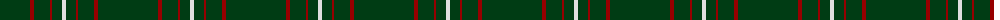
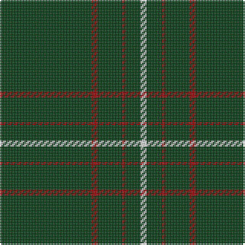

The parent of this is [Dewi Sant](/tartans/dg/60/dr4/dg16/dr2/dg10/ln/4/)

This was sourced from register-of-tartans.  It is a [6 stripes tartan](/stripes/stripes6/).

Original link https://www.tartanregister.gov.uk/tartanDetails.aspx?ref=5904

## Thread count
DG/60 DR4 DG16 DR2 DG10 LN/4

## Palette
Each colour and its ΔE from the base-6 reference it is a variant of.

| Colour | Shade | Base | ΔE (OKLab) |
|---|---|---|---|
| DG |  `#003C14` | G  | 0.14 |
| DR |  `#960000` | R  | 0.11 |
| LN |  `#E0E0E0` | W  | 0.06 |

# Sample pattern

ID: /variants/dg/60/dr4/dg16/dr2/dg10/ln/4-dg003c14-dr960000-lne0e0e0/
