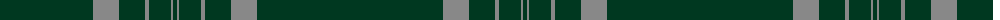

The parent of this is [Highlander (Corporate)](/tartans/dg/66/dga8/dg8/dga8/dg10/dg26/n26/dgb26/n4/dga22/n2/dgc/4/)

This was sourced from tartans-authority.  It is a [12 stripes tartan](/stripes/stripes12/).

Original link http://www.tartansauthority.com/tartan-ferret/display/4211/

## Thread count
DG/66 DGa8 DG8 DGa8 DG10 DG26 N26 DGb26 N4 DGa22 N2 DGc/4

## Palette
Each colour and its ΔE from the base-6 reference it is a variant of.

| Colour | Shade | Base | ΔE (OKLab) |
|---|---|---|---|
| DG |  `#003820` | G  | 0.16 |
| DGa |  `#003820` | G  | 0.16 |
| DGb |  `#003820` | G  | 0.16 |
| DGc |  `#003820` | G  | 0.16 |
| N |  `#888888` | R  | 0.24 |

ID: /variants/dg/66/dga8/dg8/dga8/dg10/dg26/n26/dgb26/n4/dga22/n2/dgc/4-dg003820-dga003820-dgb003820-dgc003820-n888888/
