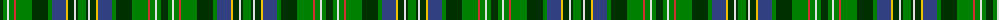

The parent of this is [Scott, hunting special](/tartans/dg/7/g4/ln2/g5/r2/g16/dg16/g4/b14/y2/dg6/ln2/dg2/g/8/)

This was sourced from weddslist.  It is a [14 stripes tartan](/stripes/stripes14/).

Original link http://www.weddslist.com/cgi-bin/tartans/pg.pl?source=sts

## Thread count
DG/7 G4 LN2 G5 R2 G16 DG16 G4 B14 Y2 DG6 LN2 DG2 G/8

## Palette
Each colour and its ΔE from the base-6 reference it is a variant of.

| Colour | Shade | Base | ΔE (OKLab) |
|---|---|---|---|
| B |  `#304080` | B  | 0.01 |
| DG |  `#003000` | G  | 0.18 |
| G |  `#008000` | G  | 0.09 |
| LN |  `#E0E0E0` | W  | 0.06 |
| R |  `#D03030` | R  | 0.05 |
| Y |  `#F0C000` | Y  | 0.01 |

ID: /variants/dg/7/g4/ln2/g5/r2/g16/dg16/g4/b14/y2/dg6/ln2/dg2/g/8-b304080-dg003000-g008000-lne0e0e0-rd03030-yf0c000/
