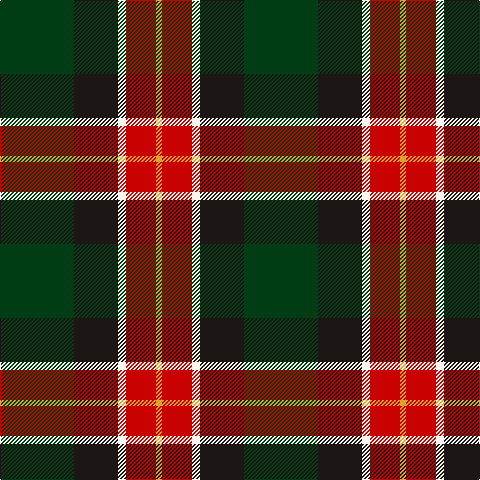

The parent of this is [Oakley (2015)](/tartans/dg/74/k44/w8/r30/y/6/)

This was sourced from register-of-tartans.  It is a [5 stripes tartan](/stripes/stripes5/).

Original link https://www.tartanregister.gov.uk/tartanDetails.aspx?ref=11255

## Thread count
DG/74 K44 W8 R30 Y/6

## Palette
Each colour and its ΔE from the base-6 reference it is a variant of.

| Colour | Shade | Base | ΔE (OKLab) |
|---|---|---|---|
| DG |  `#003C14` | G  | 0.14 |
| K |  `#1C1714` | K  | 0.21 |
| R |  `#C80000` | R  | 0.00 |
| W |  `#F9F5EF` | W  | 0.01 |
| Y |  `#E0A126` | Y  | 0.08 |

# Sample pattern

ID: /variants/dg/74/k44/w8/r30/y/6-dg003c14-k1c1714-rc80000-wf9f5ef-ye0a126/
