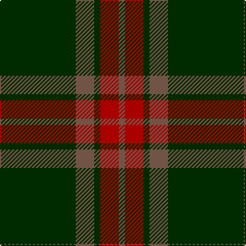

The parent of this is [Glen Trool](/tartans/dg/74/lt18/dg6/r18/lt/6/)

This was sourced from weddslist.  It is a [5 stripes tartan](/stripes/stripes5/).

Original link http://www.weddslist.com/cgi-bin/tartans/pg.pl?source=sts

## Thread count
DG/74 LT18 DG6 R18 LT/6

## Palette
Each colour and its ΔE from the base-6 reference it is a variant of.

| Colour | Shade | Base | ΔE (OKLab) |
|---|---|---|---|
| DG |  `#003000` | G  | 0.18 |
| LT |  `#806050` | R  | 0.17 |
| R |  `#C00000` | R  | 0.02 |

# Sample pattern

ID: /variants/dg/74/lt18/dg6/r18/lt/6-dg003000-lt806050-rc00000/
