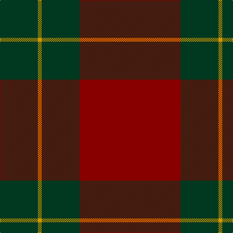

The parent of this is [Scottish Watch](/tartans/dg/78/dy8/dg78/dr/208/)

This was sourced from register-of-tartans.  It is a [4 stripes tartan](/stripes/stripes4/).

Original link https://www.tartanregister.gov.uk/tartanDetails.aspx?ref=3749

## Thread count
DG/78 DY8 DG78 DR/208

## Palette
Each colour and its ΔE from the base-6 reference it is a variant of.

| Colour | Shade | Base | ΔE (OKLab) |
|---|---|---|---|
| DG |  `#003820` | G  | 0.16 |
| DR |  `#880000` | R  | 0.14 |
| DY |  `#D09800` | Y  | 0.11 |

# Sample pattern

ID: /variants/dg/78/dy8/dg78/dr/208-dg003820-dr880000-dyd09800/
