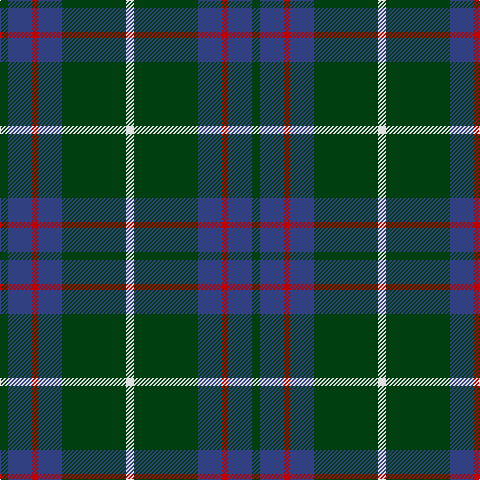

The parent of this is [MacIntyre](/tartans/dg/8/b24/r6/b24/dg64/ln/8/)

This was sourced from weddslist.  It is a [6 stripes tartan](/stripes/stripes6/).

Original link http://www.weddslist.com/cgi-bin/tartans/pg.pl?source=sts

## Thread count
DG/8 B24 R6 B24 DG64 LN/8

## Palette
Each colour and its ΔE from the base-6 reference it is a variant of.

| Colour | Shade | Base | ΔE (OKLab) |
|---|---|---|---|
| B |  `#304080` | B  | 0.01 |
| DG |  `#004010` | G  | 0.12 |
| LN |  `#E0E0E0` | W  | 0.06 |
| R |  `#C00000` | R  | 0.02 |

# Sample pattern

ID: /variants/dg/8/b24/r6/b24/dg64/ln/8-b304080-dg004010-lne0e0e0-rc00000/
