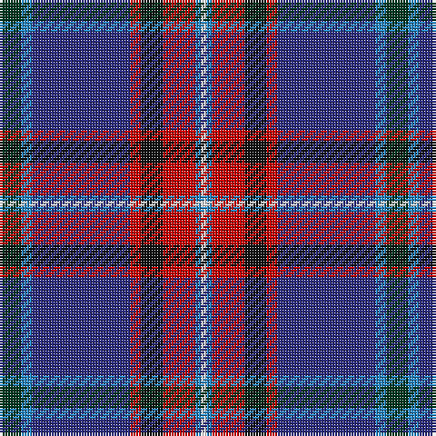

The parent of this is [Glenn (Name)](/tartans/dg/8/b4/db36/r4/k8/r12/b2/w/2/)

This was sourced from tartans-authority.  It is a [8 stripes tartan](/stripes/stripes8/).

Original link http://www.tartansauthority.com/tartan-ferret/display/5930/

## Thread count
DG/8 B4 DB36 R4 K8 R12 B2 W/2

## Palette
Each colour and its ΔE from the base-6 reference it is a variant of.

| Colour | Shade | Base | ΔE (OKLab) |
|---|---|---|---|
| B |  `#2888C4` | B  | 0.21 |
| DB |  `#2C2C80` | B  | 0.05 |
| DG |  `#003820` | G  | 0.16 |
| K |  `#101010` | K  | 0.17 |
| R |  `#C80000` | R  | 0.00 |
| W |  `#FCFCFC` | W  | 0.03 |

# Sample pattern

ID: /variants/dg/8/b4/db36/r4/k8/r12/b2/w/2-b2888c4-db2c2c80-dg003820-k101010-rc80000-wfcfcfc/
