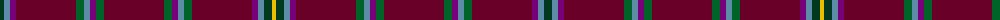

The parent of this is [Islay Whisky Club Corporate Weavers Tartan Tartan Number: 3818. Earliest known date: 2002 A tartan for members of the Islay Whisky Club and for sale only through that club. info@islaywhiskyclub.com See products available Copyright © Blair Urquhart, Comrie, 2015](/tartans/dg/8/b6/p6/dr60/g8/b6/p6/g8/dr60/g8/p6/b6/g8/dr60/p6/b6/dg8/y/4/)

This was sourced from house-of-tartan.  It is a [18 stripes tartan](/stripes/stripes18/).

Original link http://www.house-of-tartan.scotland.net/house/TartanViewjs.asp?colr=Def&tnam=3818

## Thread count
DG/8 B6 P6 DR60 G8 B6 P6 G8 DR60 G8 P6 B6 G8 DR60 P6 B6 DG8 Y/4

## Palette
Each colour and its ΔE from the base-6 reference it is a variant of.

| Colour | Shade | Base | ΔE (OKLab) |
|---|---|---|---|
| B |  `#5C8CA8` | B  | 0.23 |
| DG |  `#003820` | G  | 0.16 |
| DR |  `#680028` | B  | 0.20 |
| G |  `#006428` | G  | 0.03 |
| P |  `#780078` | B  | 0.16 |
| Y |  `#E8C000` | Y  | 0.00 |

ID: /variants/dg/8/b6/p6/dr60/g8/b6/p6/g8/dr60/g8/p6/b6/g8/dr60/p6/b6/dg8/y/4-b5c8ca8-dg003820-dr680028-g006428-p780078-ye8c000/
