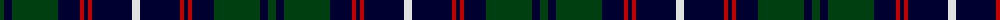

The parent of this is [New Golf Club](/tartans/dg/8/db8/dg46/db22/r4/db4/r4/db40/ln/8/)

This was sourced from weddslist.  It is a [9 stripes tartan](/stripes/stripes9/).

Original link http://www.weddslist.com/cgi-bin/tartans/pg.pl?source=sts

## Thread count
DG/8 DB8 DG46 DB22 R4 DB4 R4 DB40 LN/8

## Palette
Each colour and its ΔE from the base-6 reference it is a variant of.

| Colour | Shade | Base | ΔE (OKLab) |
|---|---|---|---|
| DB |  `#000030` | K  | 0.17 |
| DG |  `#004010` | G  | 0.12 |
| LN |  `#E0E0E0` | W  | 0.06 |
| R |  `#C00000` | R  | 0.02 |

ID: /variants/dg/8/db8/dg46/db22/r4/db4/r4/db40/ln/8-db000030-dg004010-lne0e0e0-rc00000/
