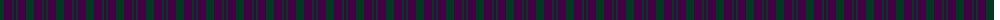
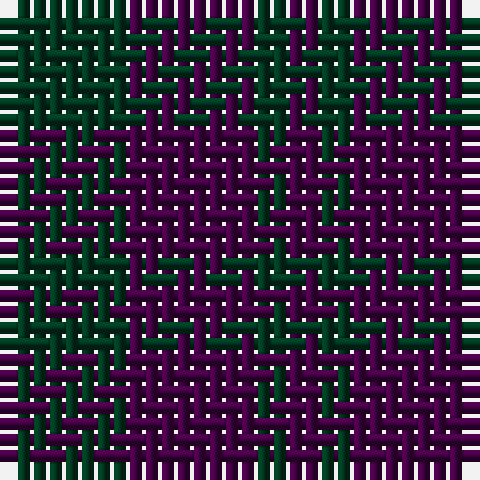

The parent of this is [Wilson's No.211](/tartans/dg/8/dp8/dg2/dp/2/)

This was sourced from register-of-tartans.  It is a [4 stripes tartan](/stripes/stripes4/).

Original link https://www.tartanregister.gov.uk/tartanDetails.aspx?ref=4742

## Thread count
DG/8 DP8 DG2 DP/2

## Palette
Each colour and its ΔE from the base-6 reference it is a variant of.

| Colour | Shade | Base | ΔE (OKLab) |
|---|---|---|---|
| DG |  `#003820` | G  | 0.16 |
| DP |  `#440044` | B  | 0.17 |

# Sample pattern

ID: /variants/dg/8/dp8/dg2/dp/2-dg003820-dp440044/
