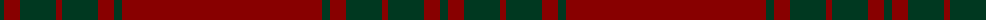

The parent of this is [KaDeWe](/tartans/dg/8/dr16/dg36/dr6/dg36/dr16/dg8/dr/200/)

This was sourced from register-of-tartans.  It is a [8 stripes tartan](/stripes/stripes8/).

Original link https://www.tartanregister.gov.uk/tartanDetails.aspx?ref=1925

## Thread count
DG/8 DR16 DG36 DR6 DG36 DR16 DG8 DR/200

## Palette
Each colour and its ΔE from the base-6 reference it is a variant of.

| Colour | Shade | Base | ΔE (OKLab) |
|---|---|---|---|
| DG |  `#003820` | G  | 0.16 |
| DR |  `#880000` | R  | 0.14 |

# Sample pattern

ID: /variants/dg/8/dr16/dg36/dr6/dg36/dr16/dg8/dr/200-dg003820-dr880000/
