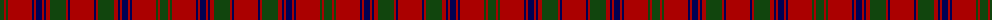

The parent of this is [MacColl](/tartans/dg/8/dr2/dg2/dr24/db2/dr2/db6/dr2/db2/dr4/dg16/dr2/db2/dr/24/)

This was sourced from weddslist.  It is a [14 stripes tartan](/stripes/stripes14/).

Original link http://www.weddslist.com/cgi-bin/tartans/pg.pl?source=x

## Thread count
DG/8 DR2 DG2 DR24 DB2 DR2 DB6 DR2 DB2 DR4 DG16 DR2 DB2 DR/24

## Palette
Each colour and its ΔE from the base-6 reference it is a variant of.

| Colour | Shade | Base | ΔE (OKLab) |
|---|---|---|---|
| DB |  `#000052` | B  | 0.20 |
| DG |  `#11450D` | G  | 0.10 |
| DR |  `#AA0000` | R  | 0.06 |

ID: /variants/dg/8/dr2/dg2/dr24/db2/dr2/db6/dr2/db2/dr4/dg16/dr2/db2/dr/24-db000052-dg11450d-draa0000/
