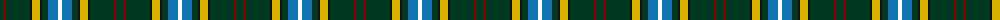

The parent of this is [Lees-McRae College (Corporate)](/tartans/dg/8/dr2/dg24/k2/y8/k2/dg6/b10/w/4/)

This was sourced from tartans-authority.  It is a [9 stripes tartan](/stripes/stripes9/).

Original link http://www.tartansauthority.com/tartan-ferret/display/4130/

## Thread count
DG/8 DR2 DG24 K2 Y8 K2 DG6 B10 W/4

## Palette
Each colour and its ΔE from the base-6 reference it is a variant of.

| Colour | Shade | Base | ΔE (OKLab) |
|---|---|---|---|
| B |  `#1474B4` | B  | 0.15 |
| DG |  `#003820` | G  | 0.16 |
| DR |  `#880000` | R  | 0.14 |
| K |  `#101010` | K  | 0.17 |
| W |  `#FCFCFC` | W  | 0.03 |
| Y |  `#D8B000` | Y  | 0.05 |

ID: /variants/dg/8/dr2/dg24/k2/y8/k2/dg6/b10/w/4-b1474b4-dg003820-dr880000-k101010-wfcfcfc-yd8b000/
