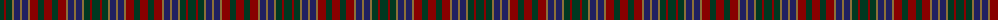

The parent of this is [University Plaid (Fashion)](/tartans/dg/8/dr2/dg6/lt2/db6/lt2/db6/lt2/dr8/dg6/dr/8/)

This was sourced from tartans-authority.  It is a [11 stripes tartan](/stripes/stripes11/).

Original link http://www.tartansauthority.com/tartan-ferret/display/4390/

## Thread count
DG/8 DR2 DG6 LT2 DB6 LT2 DB6 LT2 DR8 DG6 DR/8

## Palette
Each colour and its ΔE from the base-6 reference it is a variant of.

| Colour | Shade | Base | ΔE (OKLab) |
|---|---|---|---|
| DB |  `#202060` | B  | 0.11 |
| DG |  `#003820` | G  | 0.16 |
| DR |  `#880000` | R  | 0.14 |
| LT |  `#8C7038` | G  | 0.18 |

ID: /variants/dg/8/dr2/dg6/lt2/db6/lt2/db6/lt2/dr8/dg6/dr/8-db202060-dg003820-dr880000-lt8c7038/
