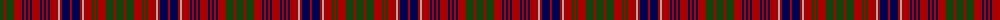

The parent of this is [MacRae](/tartans/dg/8/dr2/dg8/dr8/db2/dr2/db2/dr2/db2/dr8/db2/dr2/db2/dr2/db2/dr8/n2/dr2/db8/dr2/db8/dr2/n2/dr8/dg2/dr2/dg2/dr8/dg8/dr2/dg/8/)

This was sourced from weddslist.  It is a [31 stripes tartan](/stripes/stripes31/).

Original link http://www.weddslist.com/cgi-bin/tartans/pg.pl?source=x

## Thread count
DG/8 DR2 DG8 DR8 DB2 DR2 DB2 DR2 DB2 DR8 DB2 DR2 DB2 DR2 DB2 DR8 N2 DR2 DB8 DR2 DB8 DR2 N2 DR8 DG2 DR2 DG2 DR8 DG8 DR2 DG/8

## Palette
Each colour and its ΔE from the base-6 reference it is a variant of.

| Colour | Shade | Base | ΔE (OKLab) |
|---|---|---|---|
| DB |  `#000052` | B  | 0.20 |
| DG |  `#11450D` | G  | 0.10 |
| DR |  `#AA0000` | R  | 0.06 |
| N |  `#AAAAAA` | Y  | 0.19 |

ID: /variants/dg/8/dr2/dg8/dr8/db2/dr2/db2/dr2/db2/dr8/db2/dr2/db2/dr2/db2/dr8/n2/dr2/db8/dr2/db8/dr2/n2/dr8/dg2/dr2/dg2/dr8/dg8/dr2/dg/8-db000052-dg11450d-draa0000-naaaaaa/
