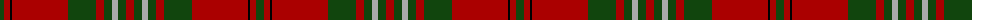

The parent of this is [Scott](/tartans/dg/8/dr6/k2/dr56/dg28/dr8/dg8/n6/dg8/dr/8/)

This was sourced from weddslist.  It is a [10 stripes tartan](/stripes/stripes10/).

Original link http://www.weddslist.com/cgi-bin/tartans/pg.pl?source=x

## Thread count
DG/8 DR6 K2 DR56 DG28 DR8 DG8 N6 DG8 DR/8

## Palette
Each colour and its ΔE from the base-6 reference it is a variant of.

| Colour | Shade | Base | ΔE (OKLab) |
|---|---|---|---|
| DG |  `#11450D` | G  | 0.10 |
| DR |  `#AA0000` | R  | 0.06 |
| K |  `#000000` | K  | 0.00 |
| N |  `#AAAAAA` | Y  | 0.19 |

ID: /variants/dg/8/dr6/k2/dr56/dg28/dr8/dg8/n6/dg8/dr/8-dg11450d-draa0000-k000000-naaaaaa/
