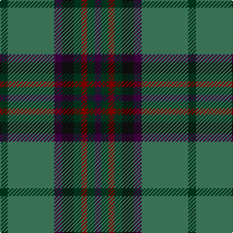

The parent of this is [Womens Rural Institute (Corporate)](/tartans/dg/8/g48/dp8/k12/dg8/dr6/dg8/dp/6/)

This was sourced from tartans-authority.  It is a [8 stripes tartan](/stripes/stripes8/).

Original link http://www.tartansauthority.com/tartan-ferret/display/4241/

## Thread count
DG/8 G48 DP8 K12 DG8 DR6 DG8 DP/6

## Palette
Each colour and its ΔE from the base-6 reference it is a variant of.

| Colour | Shade | Base | ΔE (OKLab) |
|---|---|---|---|
| DG |  `#003820` | G  | 0.16 |
| DP |  `#440044` | B  | 0.17 |
| DR |  `#880000` | R  | 0.14 |
| G |  `#408060` | G  | 0.13 |
| K |  `#101010` | K  | 0.17 |

# Sample pattern

ID: /variants/dg/8/g48/dp8/k12/dg8/dr6/dg8/dp/6-dg003820-dp440044-dr880000-g408060-k101010/
