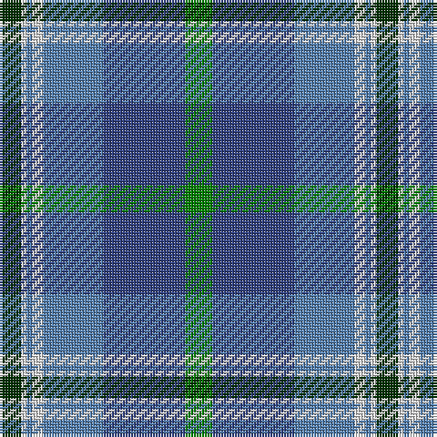

The parent of this is [Highlands Country Club](/tartans/dg/8/ln2/ba2/ln4/ba22/b30/g/10/)

This was sourced from weddslist.  It is a [7 stripes tartan](/stripes/stripes7/).

Original link http://www.weddslist.com/cgi-bin/tartans/pg.pl?source=sts

## Thread count
DG/8 LN2 Ba2 LN4 Ba22 B30 G/10

## Palette
Each colour and its ΔE from the base-6 reference it is a variant of.

| Colour | Shade | Base | ΔE (OKLab) |
|---|---|---|---|
| B |  `#304080` | B  | 0.01 |
| Ba |  `#5480B0` | B  | 0.20 |
| DG |  `#003000` | G  | 0.18 |
| G |  `#008000` | G  | 0.09 |
| LN |  `#E0E0E0` | W  | 0.06 |

# Sample pattern

ID: /variants/dg/8/ln2/ba2/ln4/ba22/b30/g/10-b304080-ba5480b0-dg003000-g008000-lne0e0e0/
