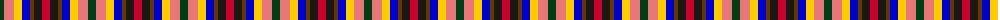
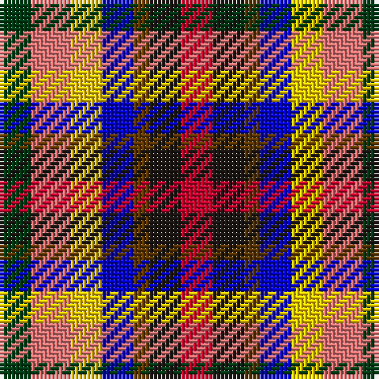

The parent of this is [Krifa-Jean (Personal)](/tartans/dg/8/lr10/y8/b8/t4/k8/r/8/)

This was sourced from register-of-tartans.  It is a [7 stripes tartan](/stripes/stripes7/).

Original link https://www.tartanregister.gov.uk/tartanDetails.aspx?ref=11232

## Thread count
DG/8 LR10 Y8 B8 T4 K8 R/8

## Palette
Each colour and its ΔE from the base-6 reference it is a variant of.

| Colour | Shade | Base | ΔE (OKLab) |
|---|---|---|---|
| B |  `#0000CD` | B  | 0.15 |
| DG |  `#003C14` | G  | 0.14 |
| K |  `#1C1714` | K  | 0.21 |
| LR |  `#E87878` | R  | 0.19 |
| R |  `#C8002C` | R  | 0.03 |
| T |  `#603800` | G  | 0.16 |
| Y |  `#FCCC00` | Y  | 0.04 |

# Sample pattern

ID: /variants/dg/8/lr10/y8/b8/t4/k8/r/8-b0000cd-dg003c14-k1c1714-lre87878-rc8002c-t603800-yfccc00/
