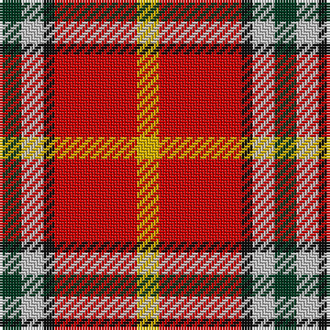

The parent of this is [Benedict (Personal)](/tartans/dg/8/n8/k4/r30/y/8/)

This was sourced from register-of-tartans.  It is a [5 stripes tartan](/stripes/stripes5/).

Original link https://www.tartanregister.gov.uk/tartanDetails.aspx?ref=247

## Thread count
DG/8 N8 K4 R30 Y/8

## Palette
Each colour and its ΔE from the base-6 reference it is a variant of.

| Colour | Shade | Base | ΔE (OKLab) |
|---|---|---|---|
| DG |  `#003820` | G  | 0.16 |
| K |  `#101010` | K  | 0.17 |
| N |  `#C0C0C0` | W  | 0.16 |
| R |  `#C80000` | R  | 0.00 |
| Y |  `#D8B000` | Y  | 0.05 |

# Sample pattern

ID: /variants/dg/8/n8/k4/r30/y/8-dg003820-k101010-nc0c0c0-rc80000-yd8b000/
