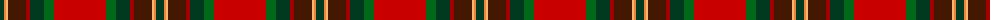

The parent of this is [Tartan Army Whisky](/tartans/dg/8/o2/lg2/dr18/dra4/dg14/g10/r/52/)

This was sourced from tartans-authority.  It is a [8 stripes tartan](/stripes/stripes8/).

Original link http://www.tartansauthority.com/tartan-ferret/display/10975/

## Thread count
DG/8 O2 LG2 DR18 DRa4 DG14 G10 R/52

## Palette
Each colour and its ΔE from the base-6 reference it is a variant of.

| Colour | Shade | Base | ΔE (OKLab) |
|---|---|---|---|
| DG |  `#003820` | G  | 0.16 |
| DR |  `#441800` | B  | 0.22 |
| DRa |  `#A00000` | R  | 0.09 |
| G |  `#006818` | G  | 0.02 |
| LG |  `#FCB464` | Y  | 0.08 |
| O |  `#EC8048` | Y  | 0.17 |
| R |  `#C80000` | R  | 0.00 |

# Sample pattern

ID: /variants/dg/8/o2/lg2/dr18/dra4/dg14/g10/r/52-dg003820-dr441800-draa00000-g006818-lgfcb464-oec8048-rc80000/
