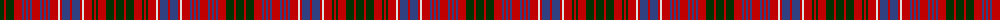

The parent of this is [MacRae](/tartans/dg/8/r2/dg8/r8/b2/r2/b2/r2/b2/r8/b2/r2/b2/r2/b2/r8/ln2/r2/b8/r2/b8/r2/ln2/r8/dg2/r2/dg2/r8/dg8/r2/dg/8/)

This was sourced from weddslist.  It is a [31 stripes tartan](/stripes/stripes31/).

Original link http://www.weddslist.com/cgi-bin/tartans/pg.pl?source=sts

## Thread count
DG/8 R2 DG8 R8 B2 R2 B2 R2 B2 R8 B2 R2 B2 R2 B2 R8 LN2 R2 B8 R2 B8 R2 LN2 R8 DG2 R2 DG2 R8 DG8 R2 DG/8

## Palette
Each colour and its ΔE from the base-6 reference it is a variant of.

| Colour | Shade | Base | ΔE (OKLab) |
|---|---|---|---|
| B |  `#304080` | B  | 0.01 |
| DG |  `#003000` | G  | 0.18 |
| LN |  `#E0E0E0` | W  | 0.06 |
| R |  `#C00000` | R  | 0.02 |

ID: /variants/dg/8/r2/dg8/r8/b2/r2/b2/r2/b2/r8/b2/r2/b2/r2/b2/r8/ln2/r2/b8/r2/b8/r2/ln2/r8/dg2/r2/dg2/r8/dg8/r2/dg/8-b304080-dg003000-lne0e0e0-rc00000/
