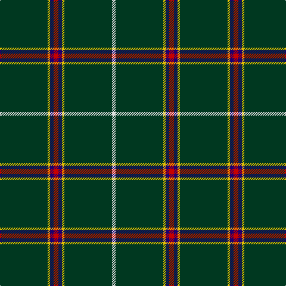

The parent of this is [Asher (Personal)](/tartans/dg/80/y4/db6/r8/db6/y4/dg80/ln/6/)

This was sourced from register-of-tartans.  It is a [8 stripes tartan](/stripes/stripes8/).

Original link https://www.tartanregister.gov.uk/tartanDetails.aspx?ref=4990

## Thread count
DG/80 Y4 DB6 R8 DB6 Y4 DG80 LN/6

## Palette
Each colour and its ΔE from the base-6 reference it is a variant of.

| Colour | Shade | Base | ΔE (OKLab) |
|---|---|---|---|
| DB |  `#1C0070` | B  | 0.14 |
| DG |  `#003820` | G  | 0.16 |
| LN |  `#E0E0E0` | W  | 0.06 |
| R |  `#C80000` | R  | 0.00 |
| Y |  `#E8C000` | Y  | 0.00 |

# Sample pattern

ID: /variants/dg/80/y4/db6/r8/db6/y4/dg80/ln/6-db1c0070-dg003820-lne0e0e0-rc80000-ye8c000/
