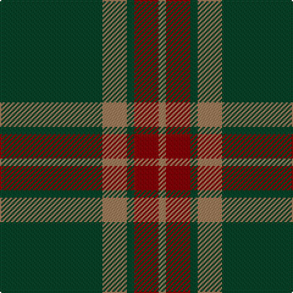

The parent of this is [Glen Trool (Fashion)](/tartans/dg/84/lt20/dg6/dr20/lt/6/)

This was sourced from tartans-authority.  It is a [5 stripes tartan](/stripes/stripes5/).

Original link http://www.tartansauthority.com/tartan-ferret/display/914/

## Thread count
DG/84 LT20 DG6 DR20 LT/6

## Palette
Each colour and its ΔE from the base-6 reference it is a variant of.

| Colour | Shade | Base | ΔE (OKLab) |
|---|---|---|---|
| DG |  `#004428` | G  | 0.12 |
| DR |  `#880000` | R  | 0.14 |
| LT |  `#A07C58` | R  | 0.19 |

# Sample pattern

ID: /variants/dg/84/lt20/dg6/dr20/lt/6-dg004428-dr880000-lta07c58/
