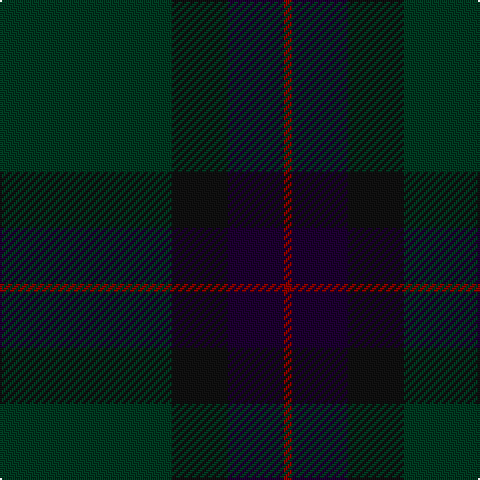

The parent of this is [Feddinch Club, St Andrews (Corp)](/tartans/dg/86/k28/ka28/dr/4/)

This was sourced from tartans-authority.  It is a [4 stripes tartan](/stripes/stripes4/).

Original link http://www.tartansauthority.com/tartan-ferret/display/2687/

## Thread count
DG/86 K28 Ka28 DR/4

## Palette
Each colour and its ΔE from the base-6 reference it is a variant of.

| Colour | Shade | Base | ΔE (OKLab) |
|---|---|---|---|
| DG |  `#003820` | G  | 0.16 |
| DR |  `#880000` | R  | 0.14 |
| K |  `#101010` | K  | 0.17 |
| Ka |  `#1C0030` | K  | 0.20 |

# Sample pattern

ID: /variants/dg/86/k28/ka28/dr/4-dg003820-dr880000-k101010-ka1c0030/
